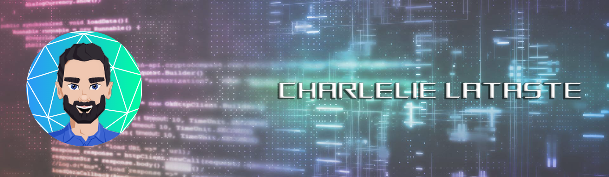

 

Hi !👋🼠I'm Charlelie ! I live in Marseille. Nice to meet you ! 🤠 
Passionate about computers (hardware and software), new technologies, video games...and coding of course 💻.
 
In 2022, I chose to change my professional life and become a <strong>developper</strong> to provide digital solutions to problems encountered by everyone. 
 
Please, take the time to look at my work ! 🙏

## Who Am I ❓

👴 Previously,  I was, for 7 years, a smartphone, tablet and computer repairer in small and large companies.  
👶 In 2022,  I completed my Fullstack Javascript training with O'Clock school. And I graduated RNCP level 5 ("Developpeur Web et Web Mobile").  
👦 Now,  
I am looking for an cooperative training course to pass the following diploma (RNCP level 6 "Concepteur Developpeur d'Application")

You can contact me here ! 📧

  
  
  

## My Skills 👨🏻‍💻

 

🎨 **FRONTEND**

       

 

💾 **BACKEND**

       

 

👨‍💻 **OS**

 

 

🖼 **LINTERS**

 

 

📚 **PROJECT MANAGEMENT**

   

 

🗃 **VERSIONNING**

   

 

⭐ **OTHERS**

       

 

🔋 **IN PROGRESS**

   

 

## Soft Skills 🗿

 

     

 

## My Stats 🔬

 

 

 

You can also check our project ! 
At the end of our studies, we created the project [Develott](https://develott.fr) and we are very proud of it ! 💪

 

Please, check our project and let me know what you think about it ! 🙏

